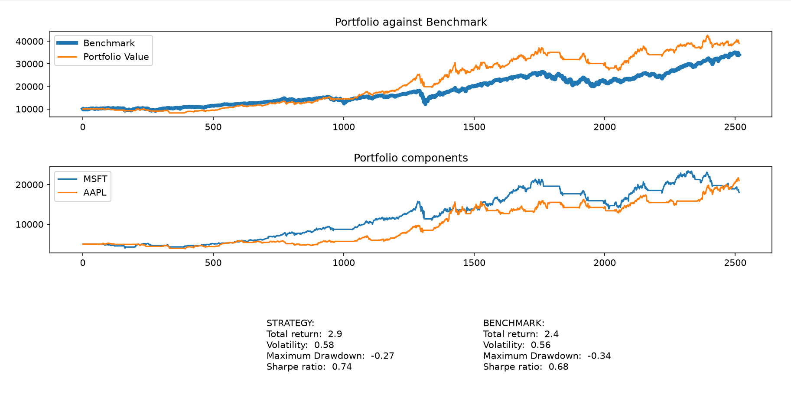

# Backtesting Framework

A Python framework for backtesting signal-based systematic trading strategies with support for single- and multi-asset execution.

The framework was built from scratch to provide a modular environment for testing systematic trading strategies on historical market data. It separates data acquisition, strategy declaration, signal generation, portfolio execution, performance evaluation, and visualization into independent components.

---

## Overview

The framework takes historical market data, applies user-defined trading strategies, simulates portfolio execution, and evaluates the resulting performance against a benchmark.

The main workflow is:

```text
Strategy creation
        ↓
Historical Market Data
        ↓
    Data Loader
        ↓
 Signal Generation
        ↓
     Backtester
        ↓
 Portfolio History
        ↓
 Performance Metrics
        ↓
 Visualization & Benchmark Comparison
```

The framework is designed so that the trading strategy is independent from the backtesting engine. This allows different strategies to be tested without modifying the underlying portfolio execution or performance evaluation logic.

---

## Key Features

### 1. Modular Strategy Interface

Strategies are defined through user-provided functions for calculating derived values and generating trading signals.

```python
Strategy = strategy(
    values={
        "sma_20": lambda row: row["Close"].rolling(20).mean(),
        "sma_60": lambda row: row["Close"].rolling(60).mean()
    },
    signals={
        "sma_20 > sma_60": lambda row: row["sma_20"] > row["sma_60"]
    }
)
```

<u>Strategy logic is completely separated from portfolio execution, allowing new strategies to be created without modifying the backtesting engine.</u>

The interface supports arbitrary user-defined calculations, making the framework independent of any particular trading strategy.

---

### 2. Historical Lookback Handling

Many systematic trading strategies require historical observations before they can generate their first valid signal.

For example, a 200-day moving average requires 200 previous observations. A naive backtester either:

* starts the calculation with missing values,
* delays the backtest until the lookback period has passed, or
* requires the user to manually download additional historical data.

<u>This framework separates the data required to calculate a strategy's indicators from the period over which the portfolio is actually backtested.</u>

The runner automatically downloads additional historical data before the requested backtest start date:

```python
data_download_start_date = (
    pd.to_datetime(start_date)
    - pd.Timedelta(days=data_before_benchmark) * 2
)
```

The indicators and signals can therefore be calculated using historical observations that precede the backtest.

The resulting data is then trimmed back to the requested start date before portfolio execution.

<u>This allows strategies using lagged variables, rolling statistics, and other historical-data-dependent signals to generate valid signals from the first day of the actual backtest.</u>

This avoids artificially delaying strategy execution simply because the strategy needs historical observations to initialize its calculations.

---

### 3. Single-Asset Strategies

The framework supports conventional systematic strategies where trading decisions are based on the quantitative data of an individual asset.

Example:

```python
Strategy = strategy(
    values={
        "sma_200": lambda row: row["Close"].rolling(200).mean(),
        "sma_50": lambda row: row["Close"].rolling(50).mean()
    },
    signals={
        "sma_200 < sma_50": lambda row: row["sma_200"] < row["sma_50"]
    }
)
```

---

### 4. Multi-Asset Strategies

<u>The framework supports strategies whose signals can depend on data from multiple assets while specifying which asset should be traded.</u>

For example, a strategy can compare the momentum of two assets and use the result to decide which one to hold.

```python
Strategy1 = multi_asset_startegy(
    "MSFT",
    values={
        "AAPL_pct_change_60": lambda data: data["AAPL"]["Close"].pct_change(20),
        "MSFT_pct_change_60": lambda data: data["MSFT"]["Close"].pct_change(20)
    },
    signals={
        "MSFT<AAPL_pctc60":
            lambda row: row["MSFT_pct_change_60"] < row["AAPL_pct_change_60"]
    }
)
```

The signal-generation layer can therefore access information outside the asset being traded.

<u>This creates a separation between the assets used as information sources and the assets on which trades are executed.</u>

This enables strategies such as:

* Relative momentum
* Cross-asset signals
* Asset selection
* Market-regime signals
* Relative-value-style rules

---

### 5. Strategy Composition

<u>Multiple independently defined strategies can be combined into a single backtest.</u>

Strategies can be placed into a list:

```python
Strategy = [Strategy1, Strategy2]
```

The backtest runner processes each strategy and combines the resulting tradable assets into the portfolio.

This allows complex portfolios to be constructed from simpler strategy components rather than requiring one large monolithic strategy definition.

---

### 6. Portfolio Simulation

The `Backtester` class simulates portfolio execution while maintaining:

* Cash
* Shares owned
* Shares value
* Total portfolio value

For multiple assets, the initial capital is divided between the selected assets and the resulting daily portfolio values are aggregated into a total portfolio value series.

<u>Portfolio execution is kept separate from signal generation, so the same execution engine can be reused across different strategies.</u>

---

### 7. Benchmark Comparison

<u>Every strategy can be evaluated against a separately constructed benchmark using the same backtesting infrastructure.</u>

The default benchmark is a buy-and-hold strategy:

```python
strategy(
    values={},
    signals={
        "buy&hold": lambda row: True
    }
)
```

This allows strategy and benchmark performance to be compared using the same:

* Portfolio accounting
* Performance metrics
* Visualization pipeline

The framework therefore evaluates not only whether a strategy made money, but also how its performance compares with a passive alternative.

---

### 8. Performance Metrics

The framework currently calculates:

| Metric           | Description                                |
| ---------------- | ------------------------------------------ |
| Total Return     | Overall portfolio return over the backtest |
| Volatility       | Annualized volatility of portfolio returns |
| Maximum Drawdown | Largest peak-to-trough decline             |
| Sharpe Ratio     | Annualized risk-adjusted return            |

<u>The Sharpe ratio uses a time-varying risk-free rate based on 3-month U.S. Treasury yields rather than assuming a constant zero risk-free rate.</u>

The Treasury yield is converted to a daily rate and aligned with the portfolio's trading dates before excess returns are calculated.

---

### 9. Visualization

The framework generates a Matplotlib dashboard containing:

* Portfolio value vs. benchmark
* Individual portfolio components
* Strategy performance metrics
* Benchmark performance metrics



---

## Architecture

The framework is divided into several components.

### `data_import.py`

Responsible for retrieving historical market data using `yfinance`.

```python
data_loader(symbols, start_date, end_date)
```

The loader accepts either a single ticker or a list of tickers and returns the corresponding historical data.

---

### `strategy.py`

Contains the strategy classes responsible for calculating derived values and trading signals.

The `strategy` class supports signals based on an individual asset's data, while `multi_asset_startegy` allows signals to incorporate information from multiple assets.

<u>The strategy layer does not perform portfolio accounting or trade execution.</u>

It is responsible only for transforming market data into trading signals.

---

### `backtest_runner.py`

Provides the high-level backtest workflow.

It coordinates:

1. Historical data acquisition
2. Lookback-data preparation
3. Strategy signal generation
4. Backtest execution
5. Benchmark construction
6. Performance metric calculation
7. Visualization

<u>The runner handles the distinction between data required for indicator calculation and data belonging to the actual backtest period.</u>

---

### `portfolio.py`

Contains the `Backtester` class.

The backtester is responsible for:

1. Initializing the portfolio
2. Processing trading signals
3. Executing buy/sell decisions
4. Updating asset values
5. Recording portfolio history
6. Aggregating multi-asset portfolio values

<u>The execution layer is independent of the strategy definition, making the portfolio engine reusable across different signal-generation approaches.</u>

---

### `metrics.py`

Contains the `Metrics` class used to evaluate portfolio performance.

The class calculates absolute and risk-adjusted performance measures and retrieves the relevant risk-free-rate data for Sharpe ratio calculation.

---

### `visual.py`

Produces the final performance dashboard using Matplotlib.

The dashboard compares the strategy with its benchmark and displays the calculated performance statistics.


---

## Project Structure

```text
backtesting-framework/
│
├── backtest_runner.py
├── data_import.py
├── strategy.py
├── portfolio.py
├── metrics.py
├── visual.py
├── main.py
│
├── examples/
│   ├── moving_average.py
│   ├── multi_asset_trend.py
│   └── stock_picking.py
│
├── images/
│   ├── Visualization.png
│   ├── Strategy against benchmark.png
│   └── Metrics comparison.png
│
├── requirements.txt
├── .gitignore
└── README.md
```

`main.py` serves as the main user-facing configuration file, while the `examples/` directory contains complete examples of different strategy types.

---

## Examples

### Moving Average Strategy

`examples/moving_average.py`

A single-asset moving-average strategy using 50- and 200-day rolling averages.

Demonstrates:

* Custom derived values
* Rolling-window calculations
* Signal generation
* Benchmark comparison

---

### Multi-Asset Trend Strategy

`examples/multi_asset_trend.py`

A multi-asset strategy comparing the relative momentum of MSFT and AAPL.

Demonstrates:

* Multi-asset data access
* Cross-asset signal generation
* Separate tradable assets
* Strategy composition

<u>This example demonstrates that the framework can distinguish between data used to generate a signal and the asset on which that signal is executed.</u>

---

### Stock-Picking Strategy

`examples/stock_picking.py`

A simple buy-and-hold strategy applied across multiple assets.

Demonstrates the portfolio's ability to handle multiple assets and aggregate their values into a single portfolio-level performance series.

---

## Installation

Clone the repository:

```bash
git clone https://github.com/BarKob/backtesting-framework.git
cd backtesting-framework
```

Create a virtual environment:

```bash
python -m venv .venv
```

Activate it on Windows:

```powershell
.venv\Scripts\Activate.ps1
```

Install the dependencies:

```bash
pip install -r requirements.txt
```

---

## Usage

The simplest way to run the framework is through `main.py`.

The main user-configurable parameters are:

```python
tickers = []              # str for a single asset, list of strings for multiple assets
start_date = ""           # "YYYY-MM-DD"
end_date = ""             # "YYYY-MM-DD"
benchmark = []            # str for a single asset, list of strings for multiple assets
starting_capital = int    # starting capital
```

A strategy is then created using the `strategy` or `multi_asset_startegy` class.

For example:

```python
Strategy = strategy(
    values={
        "sma_20": lambda row: row["Close"].rolling(20).mean(),
        "sma_60": lambda row: row["Close"].rolling(60).mean()
    },
    signals={
        "sma_20 > sma_60": lambda row: row["sma_20"] > row["sma_60"]
    }
)
```

The backtest is then run through:

```python
run_the_backtester(
    tickers,
    start_date,
    end_date,
    benchmark,
    starting_capital,
    Strategy
)
```

The framework handles data acquisition, signal generation, portfolio execution, metric calculation, and visualization automatically.

---

## Performance Evaluation

The framework evaluates strategies using both absolute and risk-adjusted measures.

### Total Return

Measures the change in portfolio value between the beginning and end of the backtest.

### Volatility

The standard deviation of daily portfolio returns is annualized to provide a measure of return variability.

### Maximum Drawdown

Measures the largest decline from a historical portfolio peak.

### Sharpe Ratio

The annualized Sharpe ratio is calculated using portfolio excess returns over the daily risk-free rate.

<u>The risk-free rate is obtained from 3-month U.S. Treasury yields and converted to a daily equivalent before being aligned with the portfolio return series.</u>

---

## Benchmarking

A strategy should not be evaluated solely on whether its portfolio value increased.

The framework therefore constructs a benchmark independently and evaluates it through the same portfolio and metrics pipeline.

The visualization compares:

* Strategy portfolio value
* Benchmark portfolio value
* Individual strategy components
* Strategy metrics
* Benchmark metrics


This provides a more meaningful evaluation of whether a strategy adds value relative to a passive alternative.

---

## Design Principles

### Modularity

<u>Data loading, strategy logic, portfolio execution, performance metrics, and visualization are implemented as separate components.</u>

### Strategy Independence

<u>The backtesting engine does not contain strategy-specific trading logic. Strategies generate signals while the backtester handles execution.</u>

### Separation of Information and Execution

<u>Multi-asset strategies can use one set of assets as information sources while executing trades on another set of assets.</u>

### Correct Historical Initialization

<u>Strategies requiring historical observations can use data preceding the actual backtest period without artificially delaying portfolio execution.</u>

### Composability

<u>Multiple independently defined strategies can be combined into a single portfolio.</u>

### Extensibility

New strategies can be tested by defining new value calculations and signals without modifying the core portfolio engine.

---

## Current Limitations

The framework focuses on the core mechanics of signal-based backtesting. It currently does not model several features present in production-grade trading systems, including:

* Transaction costs
* Bid-ask spreads
* Slippage
* Market impact
* Short selling
* Leverage
* Portfolio-level risk constraints
* Intraday execution
* Advanced position sizing
* Advanced order types
* Corporate actions beyond the adjusted historical data provided by the data source

These limitations mean that the framework should be viewed as a **research and educational backtesting framework rather than a production trading system**.

---

## Future Improvements

Potential extensions include:

* Transaction cost and slippage modelling
* More flexible position sizing
* Short positions and leverage
* Portfolio-level risk management
* Additional performance metrics
* Unit and integration testing
* More sophisticated order execution models
* Support for additional market-data providers
* Improved experiment management
* Automated data caching and management

---

## Technologies

* Python
* Pandas
* NumPy
* Matplotlib
* yfinance

---

## Project Status

This is an ongoing personal project focused on building a modular foundation for systematic trading research.

<u>The project was implemented from scratch without relying on a dedicated quantitative trading or backtesting framework.</u>

The primary focus has been on designing the interaction between strategy definition, historical data processing, signal generation, portfolio execution, and performance evaluation rather than optimizing any particular trading strategy.
